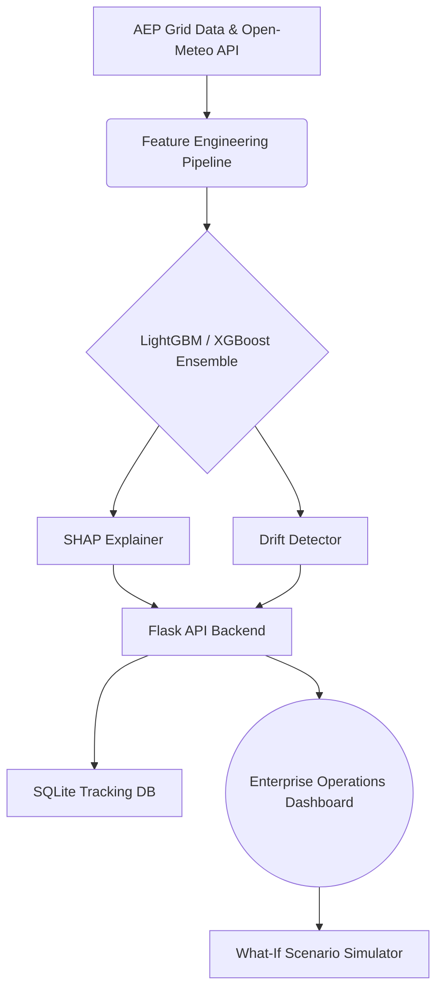

# ⚡ Power Grid Intelligence Platform

[]()
[]()
[]()
[]()

An enterprise-grade, end-to-end Machine Learning Operations (MLOps) platform designed for real-time power grid load forecasting, anomaly detection, and operational monitoring. 

This project evolved from a standard predictive modeling exercise into a full-scale **Operations Center Console** tailored for utility operators, showcasing production-ready ML engineering, physics-informed corrections, and interactive telemetry.

---

## 🌟 Key Capabilities

### 1. Advanced Forecasting Engine
* **Real-World Data**: Ingests and processes actual AEP (American Electric Power) hourly energy consumption data instead of synthetic sets.
* **Ensemble Modeling**: Utilizes highly optimized `LightGBM` and `XGBoost` models for rapid, accurate load predictions.
* **Quantile Uncertainty**: Generates confidence intervals (10th and 90th percentiles) to help operators bound worst-case and best-case load scenarios.

### 2. Operations Center UI
* **Real-Time Telemetry**: A dark-mode, enterprise-grade dashboard displaying operational metrics like current load, reserve margins, and system capacity.
* **Grid Alerts Engine**: Automated monitoring that triggers visual alerts for threshold violations (e.g., severe load spikes or capacity limits).
* **Substation Map**: Interactive SVG visualization of the grid topology.

### 3. Explainable AI (XAI)
* **SHAP Integration**: Employs local and global SHAP (SHapley Additive exPlanations) values to provide human-readable explanations of exactly *why* a specific prediction was made (e.g., "High temperature contributed +15 MW").
* **Physics-Informed Adjustments**: Applies logical, domain-specific corrections (like thermomechanical bounds for cooling loads) ensuring model outputs remain physically credible.

### 4. MLOps & Reliability
* **Automated Retraining**: Built-in pipeline for triggering model retraining as new telemetry data arrives.
* **Data Drift Detection**: Calculates rolling Z-scores to detect statistically significant shifts in consumption patterns over time.
* **Feedback Loop**: Logs predictions and operator actions to a local SQLite database (`data/predictions.db`) for continuous improvement.
* **Live Weather Integration**: Connects to the Open-Meteo API for real-time, localized meteorological data integration.

---

## 🏗️ Architecture



---

## 🚀 Quick Start (Docker)

The easiest way to run the platform is using Docker. Ensure Docker and Docker Compose are installed on your system.

1. **Clone the repository:**
   ```bash
   git clone https://github.com/Raju-09/ms-PowerForcast.git
   cd ms-PowerForcast
   ```

2. **Launch the stack:**
   ```bash
   docker-compose up --build
   ```

3. **Access the Operations Center:**
   Open your browser and navigate to: `http://localhost:5000`

---

## 💻 Local Development Setup

If you prefer to run the application natively without Docker:

1. **Create a Virtual Environment:**
   ```bash
   python -m venv venv
   source venv/bin/activate  # On Windows: venv\Scripts\activate
   ```

2. **Install Dependencies:**
   ```bash
   pip install -r requirements.txt
   ```

3. **Train the Initial Model:**
   *Note: This will fetch the latest AEP dataset, build features, train the LightGBM/XGBoost models, and save the SHAP explainers.*
   ```bash
   python train_model.py
   ```

4. **Start the Flask Server:**
   ```bash
   python app.py
   ```

---

## 🧪 Testing

The platform includes a comprehensive suite of unit and integration tests.

```bash
pytest tests/ -v
```

---

## 📂 Project Structure

```text
ms-PowerForcast/
├── app.py                  # Core Flask routing and API logic
├── train_model.py          # Model fitting and SHAP explainer persistence
├── requirements.txt        # Python dependencies
├── Dockerfile              # Docker container definition
├── docker-compose.yml      # Multi-container orchestration
├── pipeline/
│   └── retrain.py          # Automated retraining workflows
├── templates/
│   └── dashboard.html      # Primary Operations Center UI
└── data/                   # (Git-ignored) Local databases and model binaries
```

---

## 🤝 Contributing
Contributions are welcome! If you are interested in expanding the grid topology, integrating new APIs, or enhancing the MLOps pipeline, please open an issue or submit a pull request.
